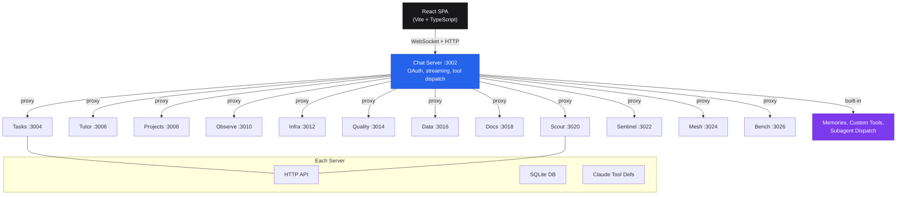

<p align="center">
  <h1 align="center">Soul</h1>
</p>

<p align="center">
  <strong>21 AI products, one WebSocket, zero external dependencies.</strong>
</p>

<p align="center">
  
  
  
  
  
  
</p>

<p align="center">
  13 Go microservices. 127 Claude tools. 21 integrated products. Fully sovereign.
</p>

---

<!-- Hero screenshot: Chat UI with product rail visible, dark theme -->
<!-- To add: capture localhost:3002 with multiple products in the rail -->

## Why Soul?

21 integrated AI products sharing one auth layer, one WebSocket protocol, one type system. Not 21 tools duct-taped together.

Every product runs as an independent Go server with its own SQLite database, but they all connect through a single chat interface. Ask Claude to generate a resume, benchmark an LLM, run a security CTF, manage tasks, or prep for an interview -- all in the same session, same protocol, same frontend.

## Architecture



The chat server acts as the gateway. When a user selects a product context, Claude receives that product's system prompt and tool definitions. Tool calls route through the chat server's dispatcher to the appropriate product's REST API. Up to 5 tool-use rounds per message, with concurrent multi-session WebSocket support.

## Products

| Product | Port | Tools | What It Does |
|---------|------|-------|--------------|
| **Chat** | 3002 | 8 | Claude streaming with multi-session WebSocket, memories, custom tools, subagent dispatch |
| **Tasks** | 3004 | 6 | Autonomous task executor -- 3-phase pipeline (implement, review, fix) with merge gates |
| **Tutor** | 3006 | 7 | Interview prep with SM-2 spaced repetition, DSA drills, mock interviews |
| **Projects** | 3008 | 6 | Implementation guide browser with 11 embedded skill-building projects |
| **Observe** | 3010 | 4 | Pillar-based observability dashboard across 6 quality dimensions |
| **Infra** | 3012 | 6 | DevOps, DBA, and migration tools |
| **Quality** | 3014 | 8 | Compliance engine (SOC2/HIPAA/GDPR) with 5 analyzers and reporting |
| **Data** | 3016 | 6 | Data engineering, cost operations, and visualization tools |
| **Docs** | 3018 | 4 | Documentation and API reference tools |
| **Scout** | 3020 | 55 | Lead pipeline CRM -- 7 pipeline types, 35 AI tools, 12-phase runner |
| **Sentinel** | 3022 | 7 | CTF security challenge platform with 14 embedded challenges |
| **Mesh** | 3024 | 4 | Distributed compute mesh with Tailscale/mDNS discovery, hub election |
| **Bench** | 3026 | 4 | LLM benchmarking harness -- 33 prompts, 10 categories, CARS scoring |

**Total: 127 tools** (119 product + 8 built-in)

## Tech Stack

| Layer | Technology |
|-------|------------|
| Backend | Go 1.24 -- 13 independent HTTP servers, standard library preferred |
| Frontend | React 19, TypeScript 5.9, Tailwind CSS v4, Vite 7 |
| AI | Claude API via OAuth, SSE streaming, multi-turn tool-use loops |
| Database | SQLite per product -- no shared state, each server owns its data |
| Real-time | WebSocket hub with multi-session routing and per-session product contexts |
| Auth | Claude OAuth (`pkg/auth`) shared across all servers |
| Testing | Go test + race detector, Vitest, Playwright, 7-layer verification stack |
| Infrastructure | systemd services, Raspberry Pi (aarch64) + x86 server |

## Project Structure

```
soul/
  cmd/              14 server entrypoints (chat, tasks, tutor, projects, ...)
  internal/         Per-product server logic, stores, handlers, and AI tools
  pkg/              Shared packages: auth, events
  web/              React SPA -- single frontend, product proxies, 14 routes
  scout/            Lead pipeline CRM (TheirStack integration, 7 pipelines)
  bench/            LLM benchmarking harness (CARS metric, 33 prompts)
  sentinel/         CTF challenge platform (14 embedded challenges)
  specs/            YAML module specs (source of truth for types.ts)
  tests/            Integration, E2E, load, and verification tests
  tools/            Build, specgen, monitoring scripts
  deploy/           systemd deployment scripts
```

## Quick Start

**Prerequisites:** Go 1.24+, Node 18+

```bash
# Clone
git clone https://github.com/rishav1305/soul.git
cd soul

# Install dependencies
go mod download
cd web && npm install && cd ..

# Build everything (13 server binaries + frontend)
make build

# Start all servers
make serve
```

The chat server starts at `http://localhost:3002`. All other product servers are proxied through it.

### Individual Servers

```bash
# Run a single server
go run cmd/chat/main.go serve
go run cmd/tasks/main.go serve
go run cmd/scout/main.go serve
```

### Verification

```bash
make verify-static   # Go vet + tsc --noEmit + secret scan + dep audit
make verify          # L1-L3: static + unit + integration tests
make types           # Regenerate types.ts from YAML specs
```

## Design Principles

Six pillars enforced on every merge through a 7-layer verification stack:

1. **Performant** -- First token < 200ms, frontend bundle < 300KB gzip
2. **Robust** -- Zero panics on any input, all DB operations atomic
3. **Resilient** -- Auto-reconnect with backoff, session restore after restart
4. **Secure** -- Parameterized SQL only, CSP headers, origin validation on WebSocket
5. **Sovereign** -- Zero external runtime dependencies, SQLite local, offline-capable
6. **Transparent** -- Structured logging, no swallowed exceptions, cost tracking per request

## Related Projects

| Project | Description |
|---------|-------------|
| [SoulGraph](https://github.com/rishav1305/soulgraph) | Enterprise multi-agent orchestration POC (LangGraph + Redis + ChromaDB) |
| [soul-team](https://github.com/rishav1305/soul-team) | Multi-agent team coordination system -- 9 specialized agents across 2 machines |
| [soul-bench](https://github.com/rishav1305/soul-bench) | Standalone LLM benchmarking tool with CARS efficiency metric |

## Author

**Rishav Chatterjee** -- Senior AI Architect

- Portfolio: [rishavchatterjee.com](https://rishavchatterjee.com)
- LinkedIn: [linkedin.com/in/rishavchatterjee](https://www.linkedin.com/in/rishavchatterjee/)
- GitHub: [github.com/rishav1305](https://github.com/rishav1305)

## License

MIT
