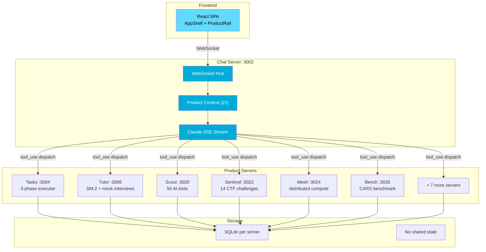

# soul


## Why soul?

Most AI platforms bolt an LLM onto a monolith. Soul is different:

- **13 independent servers**, not one fragile process. Each owns its database, its API, its failure domain.
- **127 tools routed through one WebSocket**, not 127 API integrations. Add a product by writing a Go handler, not rebuilding the frontend.
- **Zero external runtime dependencies.** No CDN, no SaaS auth, no cloud database. Everything runs on your hardware, offline if needed.
- **6 design pillars enforced on every merge** — not aspirational guidelines, but automated gates that block non-compliant code.

The result: a platform you can run on a Raspberry Pi and a spare server, coordinating 9 AI agents without a single cloud dependency.

---

Multi-agent AI platform. 13 Go microservices, 79 packages, 9 specialized AI agents distributed across 2 machines (Raspberry Pi 5 + x86 server). Claude tool-use routes through a product context layer to 21 backend products — task execution, interview prep, lead pipeline CRM, LLM benchmarking, CTF challenges, distributed compute, compliance scanning. Each server owns its SQLite database. Zero external runtime dependencies.

## Architecture

```
                          ┌──────────────────────────┐
                          │   React SPA (AppShell)   │
                          │   ProductRail · Chat     │
                          │   Tasks · Tutor · Scout  │
                          └────────────┬─────────────┘
                                       │ WebSocket
                                       ▼
                          ┌──────────────────────────┐
                          │   Chat Server :3002      │
                          │   WS Hub · SSE Stream    │
                          │   Product Context (21)   │
                          │   tool_use → dispatch    │
                          └──────┬───────────┬───────┘
                      HTTP proxy │           │ HTTP proxy
               ┌─────────────────┘           └──────────────────┐
               ▼                                                 ▼
┌──────────────────────────────┐          ┌──────────────────────────────┐
│  Tasks:3004   Tutor:3006     │          │  Scout:3020  Sentinel:3022  │
│  Projects:3008 Observe:3010  │          │  Mesh:3024   Bench:3026     │
│  Infra:3012  Quality:3014    │          │                              │
│  Data:3016   Docs:3018       │          │  Each: own SQLite, own API   │
└──────────────────────────────┘          └──────────────────────────────┘
```



## Capabilities

- **Autonomous task execution** — 3-phase pipeline (implement → review → fix) with merge gates, hooks, and comment-driven re-dispatch
- **Multi-session WebSocket** — concurrent chat sessions per connection, per-session product context, real-time streaming
- **127 Claude tools** across 21 products — tool-use dispatch with up to 5 rounds per message
- **Session persistence** — SQLite-backed sessions with memories, custom tool definitions, and conversation history
- **Zero external runtime deps** — no CDNs, no SaaS, self-hosted auth, offline-capable
- **7-layer verification** — static analysis, unit tests, integration tests, E2E, load tests, code review, visual regression

## Services

| Service | Port | What it does |
|---------|------|-------------|
| **chat** | 3002 | WebSocket hub, Claude streaming, multi-session routing, product proxy |
| **tasks** | 3004 | Autonomous executor — 3-phase pipeline, merge gates, comment watcher |
| **tutor** | 3006 | Interview prep — SM-2 spaced repetition, 5 modules, mock sessions |
| **projects** | 3008 | Implementation guides — 11 embedded projects, milestone tracking |
| **observe** | 3010 | Pillar-based observability — 13 metrics endpoints |
| **infra** | 3012 | DevOps, DBA health, migration planning |
| **quality** | 3014 | Compliance (SOC2/HIPAA/GDPR), QA, analytics |
| **data** | 3016 | Data engineering, cost ops, visualization |
| **docs** | 3018 | Technical docs, API reference generation |
| **scout** | 3020 | Lead pipeline CRM — 55 AI tools, 7 pipeline types |
| **sentinel** | 3022 | CTF platform — 14 challenges, sandbox sessions |
| **mesh** | 3024 | Distributed compute — Tailscale + mDNS, hub election |
| **bench** | 3026 | LLM benchmarking — CARS metric, 33 prompts, multi-model compare |

## Tech Stack

| Layer | Technology |
|-------|-----------|
| Backend | Go 1.24 — standard library, 79 packages |
| Frontend | React 19, TypeScript 5.9, Tailwind CSS v4, Vite 7 |
| Real-time | WebSocket — multi-session, per-session product context |
| AI | Claude API (OAuth) — SSE streaming, tool-use, multi-turn |
| Storage | SQLite per server — no shared state, atomic operations |
| Auth | Claude OAuth — shared credential, 0600 file permissions |
| Testing | Go test + race detector, Vitest, Playwright |

## Design Pillars

Six non-negotiable constraints enforced on every merge:

| Pillar | What it means |
|--------|--------------|
| **Performant** | First token < 200ms, frontend < 300KB gzipped, zero unnecessary re-renders |
| **Robust** | No panic on any input (fuzz-tested), defined behavior for nil/empty/oversized |
| **Resilient** | Auto-reconnect on disconnect, session restore on restart, graceful degradation |
| **Secure** | Zero secrets in code, all input sanitized, parameterized SQL, OAuth 0600 |
| **Sovereign** | Self-hosted everything, no CDN/SaaS dependencies, offline-capable |
| **Transparent** | Full observability, every error user-visible, type system prevents invalid states |

## Quick Start

```bash
go mod download && cd web && npm install && cd ..
make build    # 13 Go binaries + frontend
make serve    # start all servers
```

Requires Go 1.24+, Node 18+, Claude OAuth credentials at `~/.claude/.credentials.json`.

```bash
make verify   # L1-L3: static analysis + unit + integration tests
```

## Related Projects

| Project | What it does | Link |
|---------|-------------|------|
| **SoulGraph** | Multi-agent RAG framework (LangGraph + ChromaDB + RAGAS) | [github.com/rishav1305/soulgraph](https://github.com/rishav1305/soulgraph) |
| **soul-team** | Runtime that deploys soul's agents across machines (courier, guardian, MCP) | [github.com/rishav1305/soul-team](https://github.com/rishav1305/soul-team) |
| **soul-bench** | CARS benchmark — cost-adjusted LLM evaluation (52 models, 7 providers) | [github.com/rishav1305/soul-bench](https://github.com/rishav1305/soul-bench) |
| **preset-toolkit** | Claude Code plugin for safe Preset/Superset dashboard management | [github.com/rishav1305/preset-toolkit](https://github.com/rishav1305/preset-toolkit) |
| **dbt-toolkit** | Claude Code plugin for dbt workflow automation | [github.com/rishav1305/dbt-toolkit](https://github.com/rishav1305/dbt-toolkit) |

## Author

**Rishav Chatterjee** — Senior AI Architect

- Portfolio: [rishavchatterjee.com](https://rishavchatterjee.com)
- CARS Dashboard: [rishavchatterjee.com/cars](https://rishavchatterjee.com/cars)
- GitHub: [github.com/rishav1305](https://github.com/rishav1305)
- LinkedIn: [linkedin.com/in/rishavchatterjee](https://linkedin.com/in/rishavchatterjee)
